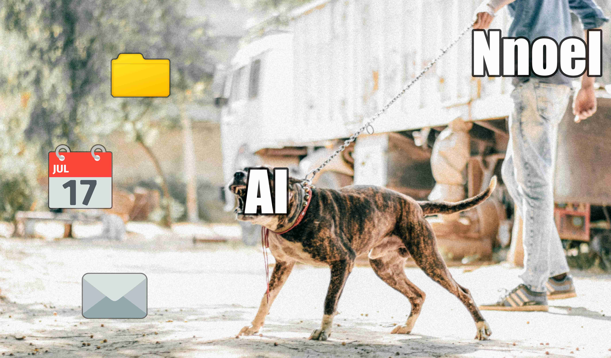

# Nnoel - Neural network on a leash
A local-first AI assistant that works with small LLMs, whose every action is tightly controlled and audited by you. Everything the AI does in the background will be visualized in the web UI.



## Goals:
- Similar goal as OpenClaw but less hands-off and more controlled active co-sessions with user. Doesn't take over full tasks but helps getting through them quicker
- Helping with e-mails, messages, appointments etc.
- Every single step executed by the AI will be visible on the UI
- Local first
- Make it well usable with smaller models (~9B) with less powerful PCs (<12Gb VRAM)
- Full static (not with prompting) permission system separate of LLM for all steps/commands/interactions with outside systems 
- Retry current message/command (conversation branches)
- Being able to manually edit suggested commands/step by the LLM
- Less functions will go through the LLM and will be separately and statically implemented
- Every function like e-mail, appointment etc. management will be provided in enableable/disableable modules enabling easier implementation of custom plugins
- RAG for longterm memory
- STT & TTS first, an assistant that you can speak with
- instead of connecting it to other messenger apps this will have a separate web ui to make everything graphically possible

## Stack

### Frontend
- Typescript
- React
- Tailwind CSS
- Vite
- Dockview
- Shadcn UI

### Backend
- Python
- FastAPI

## Setup

### 1. Configure

Edit `config.toml` to point to your llama.cpp server:

```toml
[llama]
url = "http://localhost:8080"

[server]
host = "127.0.0.1"
port = 5000
```

### 2. Install backend

```bash
python3 -m venv .venv
source .venv/bin/activate
```

### 3. Upgrade Pip

```bash
pip install --upgrade pip
```

### 4. Install needed packages

```bash
pip install -r requirements.txt
```

### 5. Install frontend

```bash
npm install
```

### 6. Build frontend

```bash
npm run build
```

### 6. Start

```bash
python server.py
```

Open the web UI at `http://{host}:{port}` (see `config.toml`).

## References
- Inspired by [OpenClaw](https://github.com/openclaw/openclaw)


t