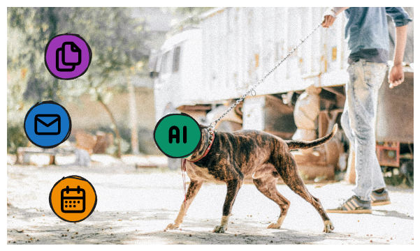

# N.n.o.a.l. - Neural Network on a Leash
A helper where every action taken by the AI is tightly controlled by permissions. Everything that happens in the background will be seen by the user.

## Goals:
- Similar goal as OpenClaw but less hands-off and more controlled active co-sessions with user. Doesnt take over full tasks but helps getting through them quicker
- Helping with e-mails, messanges, appointments etc.
- Every single step executed by the AI will be visible on the UI
- Local first
- Make it well usable with smaller models (~9B) with less powerful PCs (~12Gb VRAM)
- Full static (not with prompting) permission system separate of LLM for all steps/commands/interactions with outside systems 
- Retry current message/command (conversation branches)
- Being able to manually edit suggested commands/step by the LLM
- 

## References
- Heavily influenced by [Kolja Beigels](https://github.com/KoljaB) Projects:
  - [AIVoiceChat](https://github.com/KoljaB/AIVoiceChat)
  - [RealtimeVoiceChat](https://github.com/KoljaB/RealtimeVoiceChat)
  - [LocalAIVoiceChat](https://github.com/KoljaB/LocalAIVoiceChat)
- Inspired by [OpenClaw](https://github.com/openclaw/openclaw)
